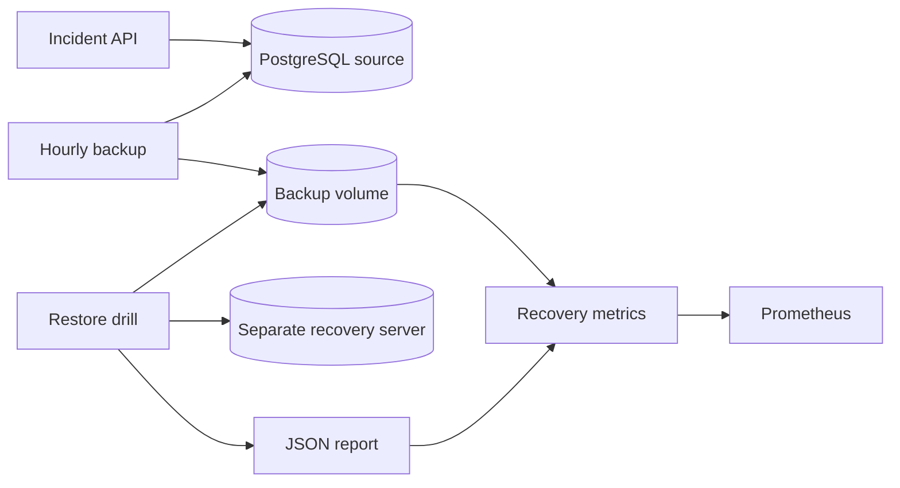

# Cloud Health API: backup and recovery lab

A backup file is useful only if it can be restored. This project takes a small incident API, gives it a PostgreSQL database, and tests that recovery works.

The interesting part is the restore drill. It restores a backup into a separate PostgreSQL server, checks every incident against the original snapshot, tests a write, records how long recovery took, and removes the temporary database. It never restores over the live database.

## Run it

You need Docker with Compose v2, Python 3, and about 2 GB of free memory for the lab. No AWS account is needed.

```bash
git clone --branch codex/backup-recovery-lab https://github.com/LeviNtengu1991/cloud-health-api-platform.git
cd cloud-health-api-platform
python3 scripts/configure.py
make build
docker compose up -d --wait
```

The setup script creates a local `.env` with separate generated passwords and an API token. It will not overwrite an existing file. Keep that file while the database volumes exist; changing passwords in `.env` does not update an initialized database.

- API: http://localhost:8080
- Prometheus: http://localhost:9090
- Recovery metrics: http://localhost:9101/metrics
- Grafana: http://localhost:3000/d/recovery-lab (start with `make dashboard`; sign in as `admin` using your generated `GRAFANA_ADMIN_PASSWORD`)

All published ports bind to localhost. PostgreSQL has no host port.

## Try a recovery

Create a record first. The following loads your local test credentials into the shell:

```bash
set -a
. ./.env
set +a
curl -s http://localhost:8080/incidents \
  -H "Authorization: Bearer $API_TOKEN" \
  -H 'Content-Type: application/json' \
  -d '{"title":"Investigate slow health checks","severity":"medium"}'

make backup
make drill
make report
```

A successful report has `success: true`, matching `expected` and `actual` row counts and SHA-256 fingerprints, `restore_seconds`, and `backup_age_seconds`. These are measurements from that drill, not a claim about a production recovery time.

The backup scheduler runs hourly and keeps seven complete snapshots. Drills are run on demand and in CI. Prometheus warns when a backup is older than two hours, a backup or drill fails, or no drill has run in the last day. Alertmanager notifications are not configured.

## S3 backups and Grafana

The optional extension adds encrypted off-host S3 copies, checksum-verified downloads, and a restore drill that always uses fresh S3 bytes. Grafana comes with an automatically provisioned 11-panel recovery dashboard. S3 and local outcomes have separate metrics and alerts.

See [the setup and demonstration guide](docs/s3-grafana.md). Existing `.env` files need `python3 scripts/configure.py --grafana` before starting Grafana. S3 requires a provisioned bucket and an authorized AWS profile; the optional Terraform configuration creates storage only when explicitly applied. CI uses a local S3 emulator and provisions Grafana without an AWS account.

## What is running



| Component | Job |
| --- | --- |
| Flask API | Create/list incidents and update their status with a version check |
| Source PostgreSQL | Store incidents; the API role cannot drop tables |
| Recovery CLI | Snapshot, checksum, restore, compare, report, and prune |
| Recovery PostgreSQL | Isolated scratch databases for drills |
| Scheduler | Hourly backups and count-based retention |
| Prometheus | Backup freshness and restore-failure alerts |
| GitHub Actions | Build containers and run the same database tests |

The backup transaction exports a PostgreSQL snapshot. Both `pg_dump` and the data fingerprint use that snapshot, so a write arriving during the dump does not cause a false mismatch. Backup folders become visible only after the archive and manifest are complete. A file lock keeps backup, pruning, and restore operations from overlapping.

## Test it

```bash
make unit
# Stop the scheduler first so fault tests have exclusive use of backup storage.
docker compose stop backup-scheduler
make integration
```

Integration tests write sample incidents and deliberately corrupt a test backup. Run them only against this disposable lab. They check API permissions, conflicting updates, recovery after source data changes, archive corruption, stale backups, same-server restore refusal, scratch cleanup, retention, and readiness during a database outage. The last successful report is saved to `artifacts/restore-report.json` and uploaded by CI.

See [the runbook](docs/runbook.md) for a walkthrough and [design choices](docs/design.md) for the tradeoffs. [Verification notes](docs/verification.md) record what was actually tested.

## Stop or remove it

`make stop` stops the containers and keeps data. To delete this lab's database and backup volumes:

```bash
make clean CONFIRM=delete-lab-data
```

Only use `clean` when you no longer need the lab records or backups. It does not touch AWS.

## Limits

This is a local recovery exercise. By default the backup volume lives on the same Docker host as the database, so losing that host would lose both. Enable the optional S3 extension for off-host copies. An operational deployment needs encrypted off-host storage, access controls, tested retention, and a separate recovery environment. These logical dumps do not provide point-in-time recovery. Adding WAL archiving would be a separate project decision.

The API uses a single local bearer token for writes. It does not implement per-user authentication, TLS, or a complete incident-management product. Read endpoints are unauthenticated; use sample data only. The restore identity has elevated permissions inside its isolated lab server to create and remove scratch databases.

The root Terraform files still describe the original ECR/ECS/CloudWatch foundation. They do not deploy this PostgreSQL recovery stack, and no AWS infrastructure is changed by these commands.

## Code quality and review

Pushes and pull requests run Ruff lint/format checks, Bandit runtime security scans, and Python regression tests. PRs also run the full recovery workflow. See [code quality and DevOps review](docs/code-quality.md) for local commands, automatic Copilot review, and the read-only DevOps reviewer profile.
